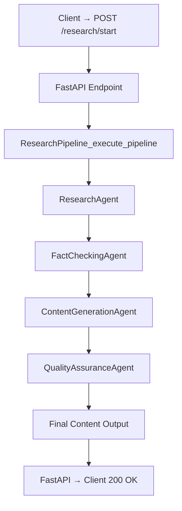
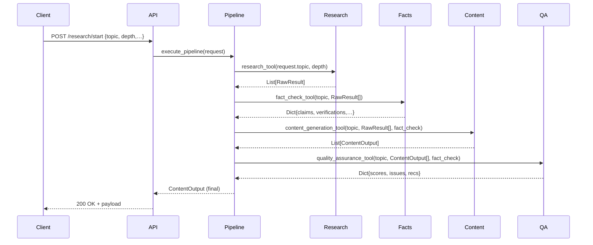

```mermaid
flowchart TD
    A[Client → POST /research/start] --> B[FastAPI Endpoint]
    B --> C[ResearchPipeline_execute_pipeline]
    C --> D[ResearchAgent] 
    D --> E[FactCheckingAgent]
    E --> F[ContentGenerationAgent]
    F --> G[QualityAssuranceAgent]
    G --> H[Final Content Output]
    H --> I[FastAPI → Client 200 OK]
```

```mermaid
sequenceDiagram
    participant Client
    participant API
    participant Pipeline
    participant Research
    participant Facts
    participant Content
    participant QA

    Client->>API: POST /research/start {topic, depth,…}
    API->>Pipeline: execute_pipeline(request)
    Pipeline->>Research: research_tool(request.topic, depth)
    Research-->>Pipeline: List[RawResult]
    Pipeline->>Facts: fact_check_tool(topic, RawResult[])
    Facts-->>Pipeline: Dict{claims, verifications,…}
    Pipeline->>Content: content_generation_tool(topic, RawResult[], fact_check)
    Content-->>Pipeline: List[ContentOutput]
    Pipeline->>QA: quality_assurance_tool(topic, ContentOutput[], fact_check)
    QA-->>Pipeline: Dict{scores, issues, recs}
    Pipeline-->>API: ContentOutput (final)
    API-->>Client: 200 OK + payload
```